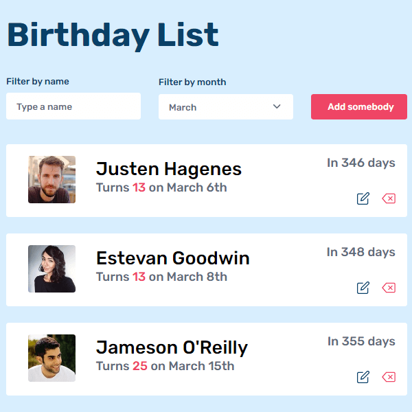

# Birthday App

[**Demo**](https://birthday-app-daniel.netlify.app/) | [**Code**](https://github.com/voromahery/birthday-app)

---

## Table of contents

- [Overview](#overview)
- [Built with](#built-with)
- [Contact](#contact)
- [Acknowledgements](#acknowledgements)
- [How to use](#how-to-use)

## [Overview](#overview)

## [Built with](#built-with)

- [HTML5](https://html.spec.whatwg.org/)
- [Vanilla Javascript](https://www.javascript.com/)
- [CSS](https://www.w3.org/Style/CSS/)

## [Acknowledgements](#acknowledgements)

A responsive CRUD (Create, Read, Update, Delete) application which is buit in order to record people's birthday.

## [Contact](#contact)

- [GitHub](https://github.com/voromahery)
